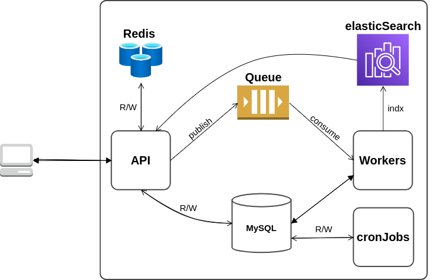

# Chat system
## Problem Statement
It’s required to build a chat system. The system should allow creating new applications where
each application will have a token(generated by the system) and a name(provided by the client).
The token is the identifier that devices use to send chats to that application.
Each application can have many chats. a chat should have a number. Numbering of chats in
each application starts from 1 and no 2 chats in the same application may have the same
number. The number of the chat should be returned in the chat creation request. A chat
contains messages and messages have numbers that start from 1 for each chat. The number of
the message should also be returned in the message creation request. The client should never
see the ID of any of the entities. The client identifies the application by its token and the chat by
its number along with the application token.
Add an endpoint for searching through messages of a specific chat. It should be able to partially
match messages’ bodies. You must use ElasticSearch for this.
The applications table should contain a column called chats_count that contains the number of
chats for this application. Similarly, the chats table should contain a column called
messages_count that contains the number of messages in this chat. These columns don’t have
to be live. However, they shouldn’t be lagging more than 1 hour.
Assume that the system is to receive many requests. It might be running on multiple servers in
parallel and thus multiple requests may be processed concurrently. Make sure to handle race
conditions. Try to minimize the queries and avoid writing directly to MySQL while serving the
requests(especially for the chats and messages creation endpoints). You can use a queuing
system to achieve that. It is allowed for chats and messages to take time to be persisted. You
should optimize your tables by adding appropriate indices.
## Stack

| Category         | Tool                                                                | Usage                                        |
|:-----------------|:--------------------------------------------------------------------|:---------------------------------------------|
| Backend server   | [GoLang](https://go.dev/) / [Gin](https://github.com/gin-gonic/gin) |                                              |
| Database         | [MySQL](https://www.mysql.com/)                                     |                                              |
| Chaching         | [Redis](https://redis.io/)                                     |                                              |
| Queueing         | [RabbitMQ](https://www.rabbitmq.com/)                               | Queuing/consuming Bulk actions requests      |
| Containerization | [Docker](https://www.docker.com/)                                   | Base environment for the stack to run inside |
### High level diagram



### System Curl
1. Create Application
```bash
curl --location --request POST 'localhost:8080/api/v1/apps' \
--header 'Content-Type: application/json' \
--data-raw '{
    "name":"instaBug"
}'
```
2. Update application
```bash
curl --location --request PUT 'localhost:8080/api/v1/apps/evtrozx' \
--header 'Content-Type: application/json' \
--data-raw '{
    "name":"instabug"
}'
```
3. Get Application by token
```bash
curl --location --request GET 'localhost:8080/api/v1/apps/evtrozx'
}'
```
4. create Chat
```bash
curl --location --request POST 'localhost:8080/api/v1/apps/evtrozx/chats'
```
5. Get Chat by chat number
```bash
curl --location --request GET 'localhost:8080/api/v1/apps/evtrozx/chats/1'
```
6. Create Message
```bash
curl --location --request POST 'localhost:8080/api/v1/apps/evtrozx/chats/1/messages' \
--header 'Content-Type: application/json' \
--data-raw '{
    "content":"wassup!!!!"
}'
```
7. Get Message by its number
```bash
curl --location --request GET 'localhost:8080/api/v1/apps/evtrozx/chats/1/messages/3'
```
8. Message autocomplete
```bash
curl --location --request GET 'localhost:8080/api/v1/apps/evtrozx/chats/1/messages/autocomplete?limit=3&page=1&keyword=hello'```
```
## Cronjobs
    running every 30 mins to update the chat and messages count
## Run The system

```bash
$ go mod tidy
$ go mod vendor
$ docker-compose up [runinng mysql,elasticsearch,redis and rabbit mq containers]
$ go run services/api/main.go [api]
$ go run services/consumer/main.go [worker]
```